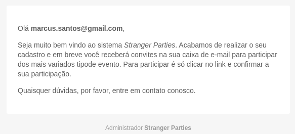
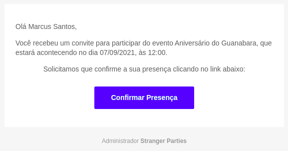

### Stranger Parties


#### Projeto
Sistema para realização da gestão de convidados e eventos

#### Descrição
Este projeto tem como finalidade notificar usuários sobre eventos e fornecer
uma maneira rapida e fácil de consultar informações sobre eventos e convidados

#### Infraestrutura
Este projeto foi construído com containers docker e possui os seguintes compomentes:

- Banco de dados Postgres
- Servidor SMTP ( http://0.0.0.0:8025 )
- Servidor da aplicação ( http://0.0.0.0:8000 )

#### Notificações
O sistema envia notificações aos usuários quando são cadastrados no sistema e quando
são convidados para um evento. Para visualizar as notificações acesse o servidor de e-mails
através da URL http://0.0.0.0:8025

- Adição de um novo convidado<br>
  


- Convite<br>
  


### Documentação da API
- [Documentação no Postman](https://documenter.postman.com/preview/1606400-f79aa54a-87ca-45b7-8a71-a378d473545d?environment=&versionTag=latest&apiName=CURRENT&version=latest&documentationLayout=classic-double-column&right-sidebar=303030&top-bar=FFFFFF&highlight=EF5B25)
- [Documentação Interna (ambiente em execução)](http://0.0.0.0:8000)

#### Iniciar o projeto Docker-Compose
```shell
docker-compose up -d
```

#### Iniciar o projeto Podman-Compose
```shell
podman-compose up -d --force-recreate --remove-orphans -V -t 0
```

#### Informações já cadastradas

O sistema já possui algumas informações pré-cadastradas para agilizar
a realização de testes na API. São eles:

- 4 Convidados
- 2 Eventos
- 1 Usuário do sistema

### API Rest ( How To )

#### Logar na API

###### Credencias de acesso
```shell
email: admin@admin.com
senha: admin@2020
```
###### Exemplo de requisição
```shell
curl --location --request POST 'http://0.0.0.0:8000/api/auth/' \
--data-raw '{
    "email": "admin@admin.com",
    "password": "admin@2020"
}'
```

#### Adicionar Convidados
```shell
curl --location --request POST "http://0.0.0.0:8000/api/guest/" \
--header "Authorization: JWT <API Key>"
--data-raw '{
  "email": "<email>",
  "name": "<string>",
  "phone": "<string>"
}'
```
#### Adicionar Eventos
```shell
curl --location --request POST "http://0.0.0.0:8000/api/event/" \
--header "Authorization: <API Key>"
--data-raw '{
  "name": "<string>",
  "date_time": "<dateTime>"
}'
```
#### Convidar Usuários para eventos
```shell
curl --location --request POST "http://0.0.0.0:8000/api/invite/" \
--header "Authorization: <API Key>" \
--data-raw "{
    "guest": [
        "<integer:guest_id>",
        "<integer:guest_id>"
    ],
    "event": "<integer:event_id>"
}"
```
#### Ver lista de convidados de um evento
```shell
curl --location --request GET "http://0.0.0.0:8000/api/event/:id/" \
--header "Authorization: JWT <API Key>"
```
###### Retorno
```json
{
  "name": "<string>",
  "total_invited": "<integer>",
  "confirmed_guests": [
    {
      "guest": {
        "email": "<email>",
        "name": "<string>",
        "phone": "<string>",
        "id": "<integer>"
      }
    },
    {
      "guest": {
        "email": "<email>",
        "name": "<string>",
        "phone": "<string>",
        "id": "<integer>"
      }
    }
  ],
  "non_confirmed_guests": [
    {
      "guest": {
        "email": "<email>",
        "name": "<string>",
        "phone": "<string>",
        "id": "<integer>"
      }
    },
    {
      "guest": {
        "email": "<email>",
        "name": "<string>",
        "phone": "<string>",
        "id": "<integer>"
      }
    }
  ],
  "id": "<integer>",
  "date_time": "<dateTime>"
}
```

### Gerar arquivo schema.yaml
Para gerar/atualizar o schema da API Rest, execute o script generate_schema.sh
dentro do container backend da seguinte forma:
```shell
docker exec -it backend bash /app/binary/generate_schema.sh
```
